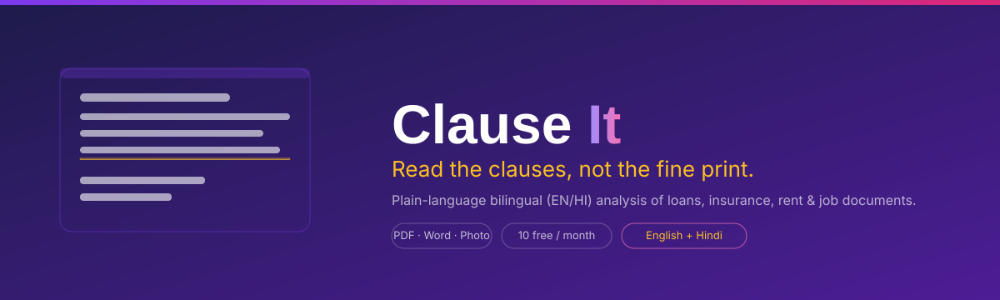

<p align="center">
  
</p>

<div align="center">


**Upload any agreement and understand it before you sign.**

</div>

ClauseIt is an India-focused web app that reads your loan agreements, insurance policies, rent contracts, and job offers, then translates them into plain language. It flags the hidden clauses, unfair charges, and deadlines that were written to be missed, and gives you a clear risk score. English and Hindi. Free to start. No lawyer required.

---

## Why ClauseIt

In India, the terms that cost you money rarely sit on the first page. They hide in schedules, footnotes, and definitions:

- A home loan with an **8% foreclosure charge** printed on page 9
- A health insurance policy with **40 excluded procedures** inside a three-line definition
- A rent agreement with an **automatic 10% yearly increase** and no exit clause
- A job offer with a **24-month service bond** equal to six months' salary

ClauseIt reads the document the way a careful reader would, and tells you what actually matters before you sign.

## Features

- **Upload anything** — PDF, DOCX, TXT, pasted text, or a photo of the page taken with your phone camera
- **Whole-document reading** — schedules, footnotes, and small print included, not keyword search
- **Plain-language summary** — in English and Hindi, with a one-click toggle
- **Hidden clause detection** — auto-renewal, one-sided liability, jurisdiction traps, and more
- **Charges and penalties** — every fee, penalty, and EMI amount in a simple table
- **Key dates** — renewals, notice periods, lock-ins, and deadlines
- **Risk score** — 0 (very fair) to 10 (very risky), with green / yellow / red levels
- **Report download** — save the analysis before you sign

## How it works

1. **Upload** — drop the PDF, Word file, or a photo of the page. Takes five seconds.
2. **ClauseIt reads it** — every line, including the ones in small print.
3. **You decide** — a plain-language summary, flagged clauses, charges, and a risk score.

## Tech stack

| Layer | Choice |
|---|---|
| Framework | [Next.js](https://nextjs.org) 16 (App Router) + TypeScript |
| Styling | [Tailwind CSS](https://tailwindcss.com) v4 + [Lucide](https://lucide.dev) icons |
| AI | [Google Gemini](https://ai.google.dev) API (server-side only, `gemini-3.6-flash`) |
| Document parsing | [unpdf](https://www.npmjs.com/package/unpdf), [mammoth](https://www.npmjs.com/package/mammoth) |
| Auth / DB / Storage | Supabase *(in progress)* |
| Payments | Razorpay *(planned)* |
| Rate limiting | Upstash *(planned)* |
| Monitoring | Sentry *(planned)* |
| Deployment | Vercel *(planned)* |

## Getting started

```bash
# 1. Install dependencies
npm install

# 2. Copy the environment template
cp .env.example .env        # Windows: copy .env.example .env

# 3. Add your Gemini API key to .env (create one at https://aistudio.google.com)
GEMINI_API_KEY=your-key-here

# 4. Run the development server
npm run dev
```

Open [http://localhost:3000](http://localhost:3000). Full setup for every service is in the [setup guide](docs/SETUP.md).

## Project structure

```
clauseit/
├─ src/
│  ├─ app/            # Pages and API routes (App Router)
│  ├─ components/     # UI components, split by feature
│  └─ lib/            # Types, file validation, text extraction, Gemini client
├─ docs/              # Feature spec and setup guide
├─ assets/            # Brand assets (README banner)
├─ AGENTS.md          # Rules every AI tool follows while building this project
└─ LICENSE            # MIT
```

## Roadmap

- [x] **Phase 1** — Foundation: brand, design system, home / how-it-works / pricing, 404, SEO meta
- [x] **Phase 2** — Upload + analysis: file validation, text extraction, Gemini analysis, results page
- [ ] **Phase 3** — Auth + quota: Supabase auth, 10/month server-side limit, dashboard
- [ ] **Phase 4** — Payments: Razorpay subscriptions and plan gating
- [ ] **Phase 5** — Premium: lawyer review section *(coming soon)*
- [ ] **Phase 6** — Polish + deploy: share links, Sentry, Vercel, custom domain

## Documentation

- [Feature specification](docs/FEATURE_SPEC.md) — page-by-page spec and phase plan
- [Setup guide](docs/SETUP.md) — accounts, keys, and environment setup
- [AGENTS.md](AGENTS.md) — engineering and security rules

## License

[MIT](LICENSE) — free to use, modify, and share.
